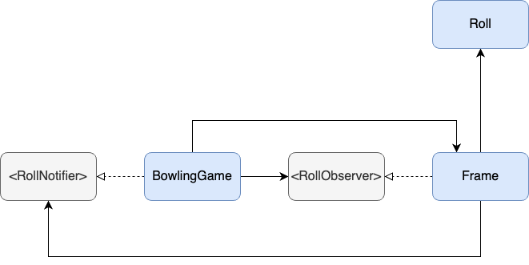

# Bowling Game Kata

I did the bowling game kata many times. The one I did in particular was from Jon Reid ([source](https://qualitycoding.org/swift-code-kata/#t-1601857680311)).

I started off the usual route but had an idea and wanted to see if I can make it work. Initially I wanted each frame to have a reference to the next two frames so that it can calculate its score based on those frame's rolls. Just when I was going for it, another thought struck me - one that appeared way simpler to me. That was to use the observer pattern such that each `Frame` can decide whether or not to observe changes to `didRoll` and apply any bonuses (`spare` or `strike`). The result was a much simpler score calculation as each `Frame` keeps track of its own score. The only place I suppose that may not seem obvious is the `roll` method in `BowlingGame`.

```swift
public func roll(_ pins: Int) {
    guard let currentFrame = _frames.last else {
        addNewFrame(pins)
        return
    }

    notifyObservers(pins)

    if currentFrame.canAddSecondRoll() {
        currentFrame.addSecondRoll(.init(pins: pins))
    } else if !hasReachedLastFrame() {
        addNewFrame(pins)
    } else {
        notifyForLastFrame(pins)
    }
}
```

It may be confusing why in the last else block, `notifyObservers` are called and why `!hasReachedLastFrame` is checked. I needed to account for the last frame with two strikes. As this is a special case and no new frames are added, I still needed to notify observers (the last frame) without adding new frames.

The code works but that does not have to mean it's necessarily good code. Looking at the dependency diagram we can see that it almost looks like there is a circular dependency. What really happens in code is that the `BowlingGame` creates a new instance of `Frame` and passes itself as the `RollNotifier`.



One last thought. Compared to a solution with two if's and one else block this solution seems way more complicated and convoluted. Regardless, I learned a lot with this exercise.

### What I have not Considered

> "*Good code gives you options*" ~ Cannot remember who but I heard it somewhere. I think it was Kent Beck 😄

I am not in a position yet where I can judge how many options I have. The only question I can think of right now is *Can I add new game modes easily?* I'd say maybe. I could extract a `Frame` protocol. Then I'd have to create new frames for the game mode and perhaps pass in a factory to `BowlingGame` so that the right frame for the game mode is created. I'd then need to inject the number of played rounds. Then again, I am no bowling expert and I may be totally wrong here.