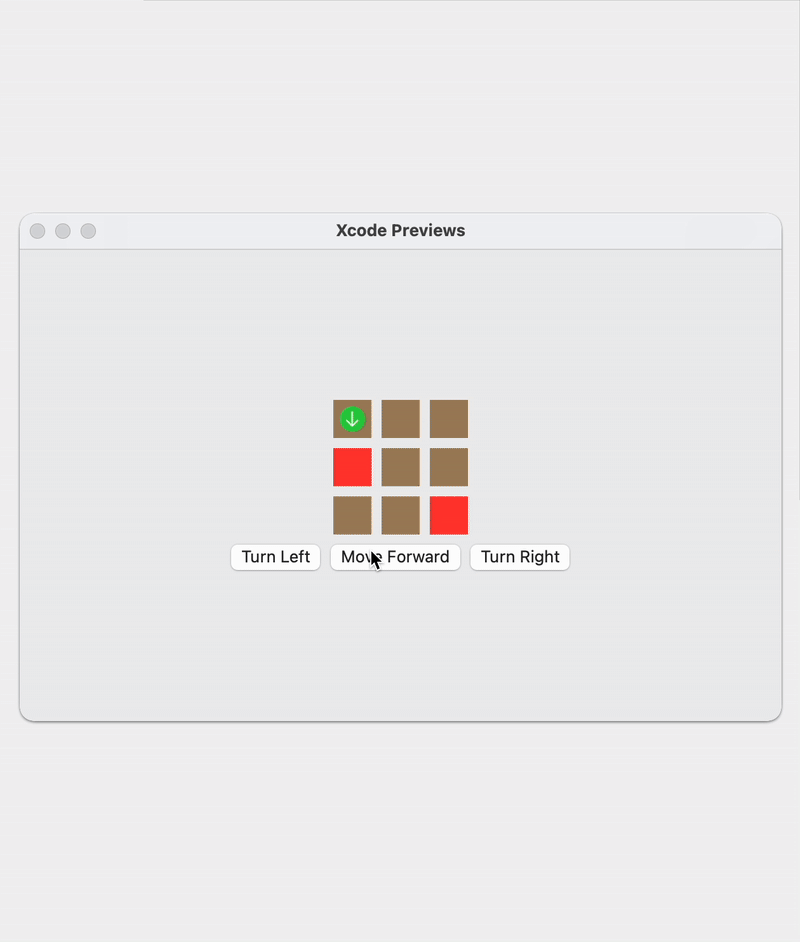

# Mars Rover Kata

[Link](https://codingdojo.org/kata/mars-rover/) to kata.

This was a fun kata. Especially after I noticed that I could use polymorphism to easily create different commands and even chain them if I wanted to. It is also very easy to create new commands. I've created a simple UI around it to visualize it and be able to interact with it.

I thought about two ways to model the map. I could either have each tile have its own coordinate and just pass a list of tiles and put the tile on the map based on its coordinate. Or I could have an array of an array of tiles where each tile only knows whether it's an obstacle or not. Therefore, I can iterate over the arrays and render the map.

While doing this kata, I've realized that perhaps developing games could be a more fun way to practice. Since the end result is something to play with (and let others play with it), it could create an even better feedback loop - especially as experience has shown me that people usually come up with completely different ideas whenever they use my apps. It could be the ultimate test of the flexibility of your code.